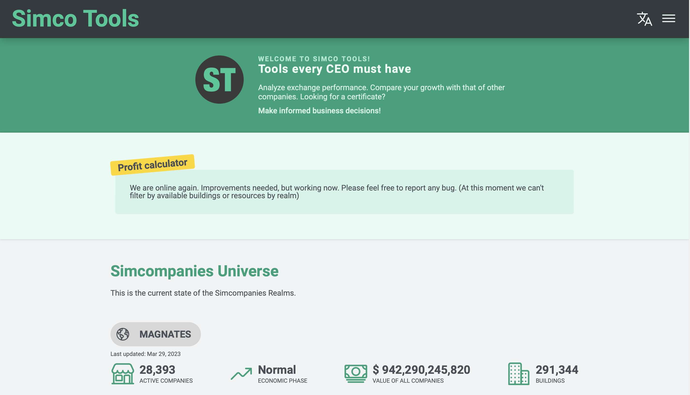
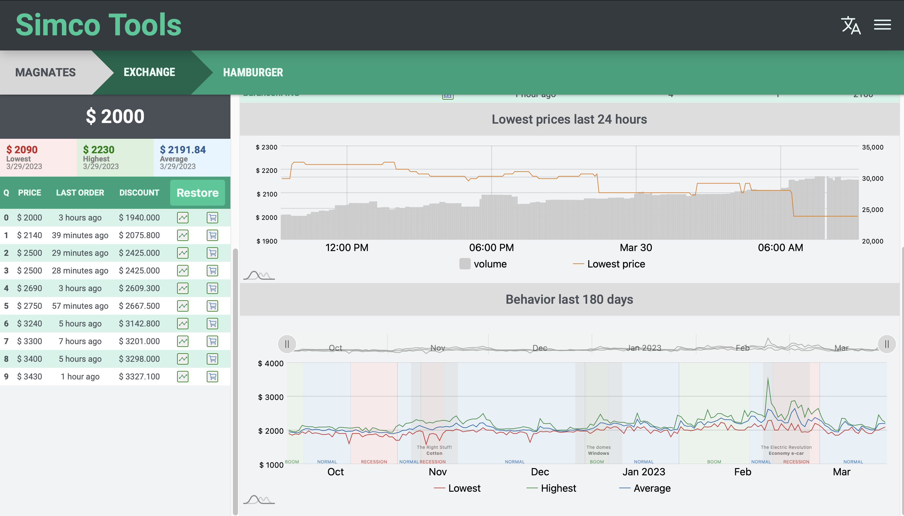
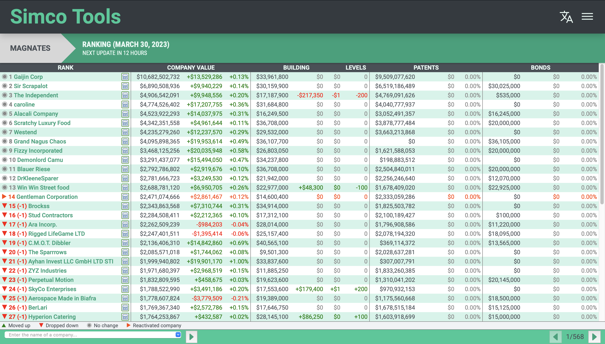
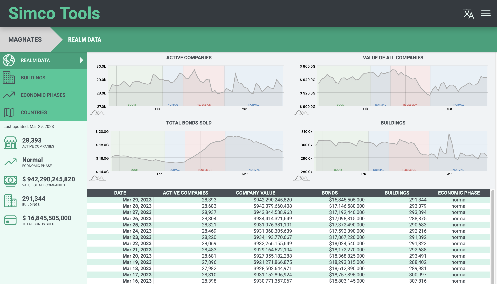



<strong>Hello! My name is Ricardo Antonio,</strong> I'm a self-taught developer from Mexico. I'm passionate about web development and I'm constantly learning new technologies to improve my skills. 




My knowledge


I have knowledge in several web development technologies, including HTML, CSS, JavaScript, React, Node, Python, Flask, MongoDB and PostgreSQL.




My projects


### Simco Tools

Fullstack project. For the frontend, I used React to create a smooth and intuitive user experience, and to complement this, I implemented libraries like am5 to generate impressive visuals and charts.

In the backend, I used Python with Flask to create APIs that support the application's logic. Additionally, I worked with PostgreSQL databases to store data in a secure and scalable way.





[Go to the project...](https://simcotools.app)

---

I'm looking for collaborations and clients so I can keep improving and growing as a web developer. If you are interested in working together on a project or need help in web development, please don't hesitate to contact me. I look forward to collaborating with you on your next project.

**Thanks for visiting my personal website!**
