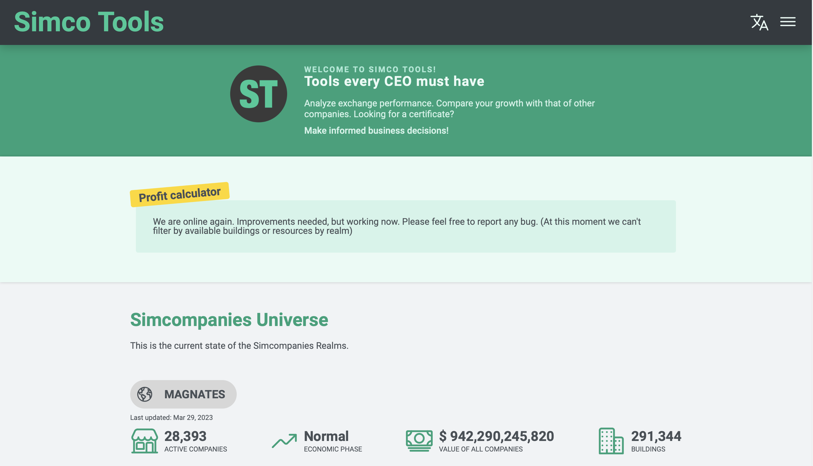
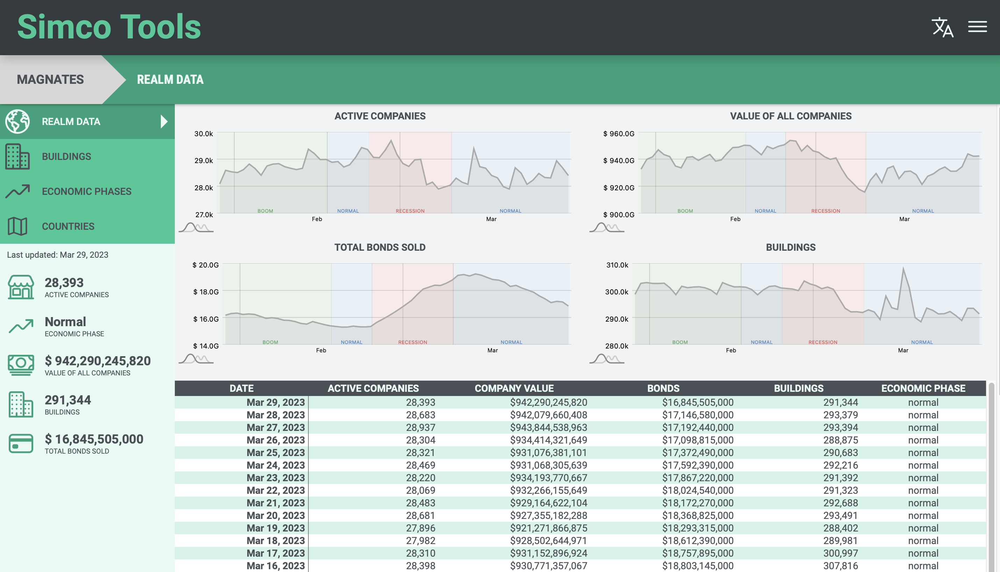



<strong>¡Hola! Mi nombre es Ricardo Antonio.</strong> Soy un desarrollador autodidacta de México. Me apasiona el desarrollo web y estoy constantemente aprendiendo nuevas tecnologías para mejorar mis habilidades.




Mis conocimientos


Poseo conocimientos en varias tecnologías de desarrollo web, incluyendo HTML, CSS, JavaScript, React, Node, Python, Flask, MongoDB y PostgreSQL.




Mis proyectos


### Simco Tools

Proyecto **Fullstack**, en el que utilicé las últimas tecnologías para diseñar una interfaz atractiva y funcional. En el frontend, utilicé React para crear una experiencia de usuario fluida e intuitiva, y para complementarla, implementé librerías como am5 para generar gráficas que le dan un toque visual impresionante.

En el backend utilicé Python con Flask para crear las APIs que soportan la lógica de la aplicación. También trabajé con bases de datos en postgresql para almacenar los datos de manera segura y escalable.





[Visitar el proyecto...](https://simcotools.app)

---

Estoy buscando colaboraciones y clientes para poder seguir mejorando y creciendo como desarrollador web. Si estás interesado en trabajar juntos en un proyecto o necesitas ayuda en el desarrollo web, por favor no dudes en contactarme. Estoy ansioso por colaborar contigo en tu próximo proyecto.

**¡Gracias por visitar mi sitio web personal!**
