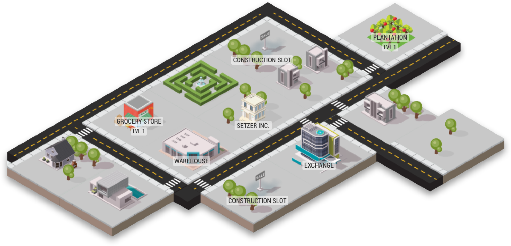
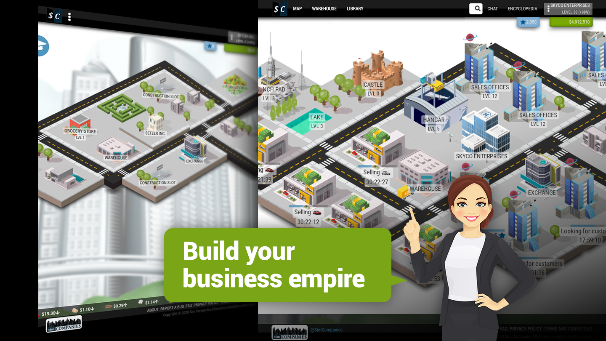
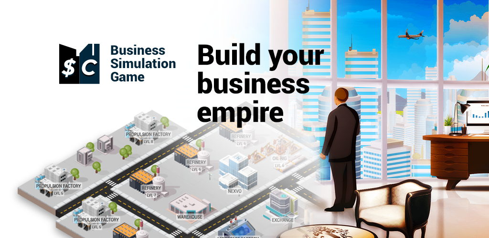

On the first day of 2021, I was at home with not much to do and looking for something to entertain myself on my phone. Since I didn't have any games installed, I decided to search for one in the app store to take advantage of those small moments of free time. That's when I discovered [Sim Companies, a great economic simulation game.](https://www.simcompanies.com/)

I don't remember exactly how I came across Sim Companies, but I'm sure my first filter in the app store was searching for simulation, strategy, and resource management games. I've always been a big fan of games like these: since I can remember, I've spent hours playing Sim Cities, Cities Skylines, Zoo Tycoon, The Sims, and other similar titles. But Sim Companies was different: instead of building cities, amusement parks, or virtual houses, this game offered me the opportunity to run my own business, learn about supply and demand, optimize processes, and create production chains. All in a competitive and dynamic environment, where my success depended on my business skills and my ability to make strategic decisions in real time.

## What is Sim Companies?

[Sim Companies](https://www.simcompanies.com/) is an exciting economic simulation game in which you'll have the opportunity to create and run your own business from scratch. At the beginning, all players have the same amount of money, $500, and a map with four buildings: the Headquarters, the market, a plantation, and a store. Through the initial tutorial, you'll learn the basic mechanics of the game, which include producing and selling products to generate money. This tutorial will teach you how to get supplies from the market, produce in a building, and sell at a retail store.

But that's just the beginning. In the game's Library, you will find guides to learn other features, such as research to improve the quality of your products, hiring executives to increase your company's efficiency, issuing bonds to raise capital, installing robots to reduce wages, and a long list of other interesting features that make it a game full of interesting characteristics.

Once you finish the tutorial, you'll have to make important decisions such as what kind of company you want to be: a retail seller, a producer, or a combination of both. With the buildings you started the game with, you'll need to keep generating money while deciding which industry to focus on. In Sim Companies, there are various industries such as agriculture, food, construction, fashion, energy, electronics, automotive, aerospace, resources, and research. Each one has its pros and cons, so you'll have to choose wisely and adapt to market changes. Each industry has its own production and retail buildings, and some buildings are more expensive than others, so starting in certain industries will be something you'll need to plan for in the future.

In Sim Companies, input prices are determined by the law of supply and demand in the exchange market. However, there are other options to obtain the resources you need for your company. Buying and selling directly to other players can be a more profitable option, although also riskier, as prices can fluctuate rapidly based on supply and demand in the market. If you have negotiation skills, you can obtain great benefits by establishing deals with other players in the game.

## What sets Sim Companies apart?

What caught my attention the most about Sim Companies is that everything happens in **real-time** and the competition is not against an AI, but against other **real people.** Not to mention, it's not a "pay to win" game. That is to say, it is not necessary to spend real money to advance or have an advantage over other players. We all compete on equal terms, which makes the experience much fairer and more exciting.

From the moment I started playing, I found myself immersed in **an active and participatory community,** where I could make interesting connections and **learn from other players.** Every decision I made had an impact on my company and the market, and I had to always be aware of trends and competition to not fall behind. But I could also seek opportunities for collaboration, exchange resources, and establish strategic alliances with other players. All of this makes Sim Companies a unique and enriching experience.

## Learning

Playing Sim Companies has taught me a lot and has been a constant learning process. I'm sure that, like me, you'll learn **business and financial skills.** If there's any concept you don't understand, don't worry, I've been in that situation too. But thanks to the Sim Companies community, available guides, and research, I've been able to better understand how businesses work. The game has helped me understand **basic accounting and economics concepts,** such as the balance sheet, income statement, and profitability. These skills are essential for managing any business, as they allow for informed decision-making and measuring the company's financial success.

Additionally, playing Sim Companies can also help you improve your language skills. By interacting with players from all over the world, **you'll have the opportunity to practice different languages** and improve your comprehension and fluency in them.

For example, In my case, as a Spanish speaker, playing Sim Companies has also helped me improve my English writing skills. You will also be able to learn specific phrases and terms related to the business world in different languages.

One of the technical skills that can be learned by playing Sim Companies is **the use of spreadsheets** to manage your business. In the game, many people use spreadsheets to more efficiently track their finances, budgets, and projections. By using spreadsheets in Sim Companies, you can learn how to use formulas and functions, which can be useful in the real world for calculations and data analysis. You can also learn how to import data and update information quickly and efficiently.

## Opportunities and challenges

**Sim Companies has been more than a game for me.** It has been a world of possibilities and opportunities that allowed me to rediscover my true passion for programming and web development. Not only did it teach me business and financial skills, but **it also provided me with the confidence and inspiration needed to pursue my dream.**

The game has a great community of dedicated and passionate players who share their knowledge and tools with others, who motivate you to advance and use your skills for others. And it was thanks to that welcoming and resourceful environment that I managed to develop [Simco Tools](https://simcotools.app).

Just like in Sim Companies, **there is no finish line to reach or end of the game.** Life is a constant process of personal growth and evolution. While developing Simco Tools, I learned new skills and knowledge that I never thought would be possible for me. I realized that what started as a simple idea in a game became a passion that now leads me to pursue a career in the world of programming. I don't know how far I will go or how fast I will progress, but I am excited to see where this path will take me in the future.

_How did a simple idea in a game become Simco Tools and what is behind its development?_ Perhaps I will tell you later, so don't hesitate to follow me on social media and stay tuned for my upcoming articles. Leave me your comments and questions so we can stay connected! **Thanks for reading!**
