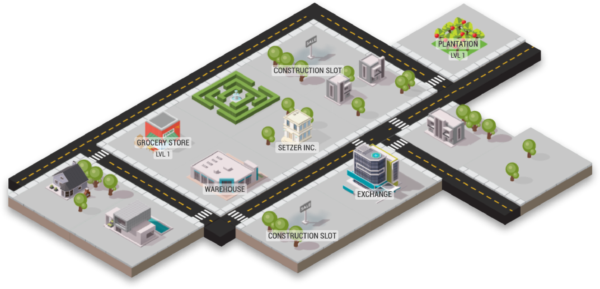
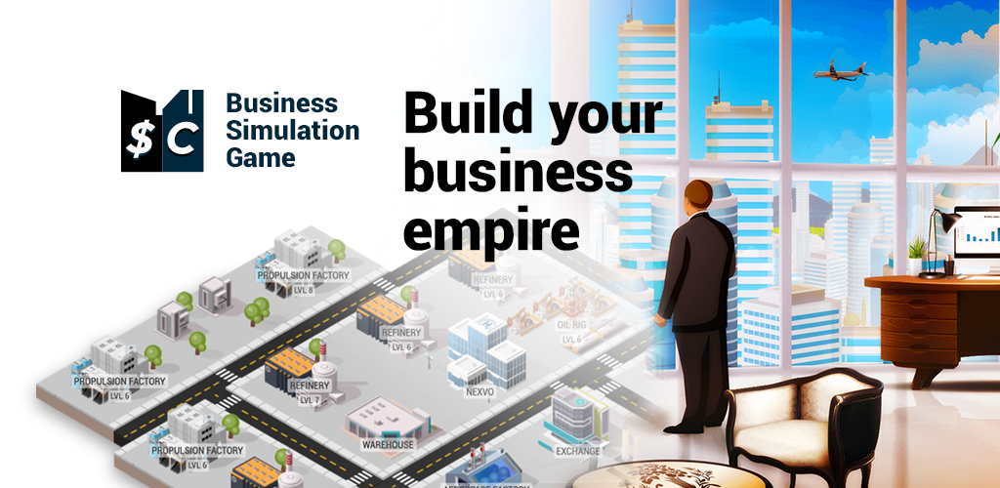

El primer día del 2021, estaba en casa sin mucho que hacer y buscaba algo para entretenerme en mi teléfono. Al no tener ningún juego instalado, decidí buscar uno en la tienda de aplicaciones para aprovechar esos pequeños espacios de tiempo libre. Fue entonces cuando descubrí [Sim Companies, un gran juego de simulación económica.](https://www.simcompanies.com/)

No recuerdo exactamente cómo llegué a Sim Companies, pero seguramente mi primer filtro en la tienda de aplicaciones fue buscar juegos de simulación, estrategia y administración de recursos. Siempre he sido un gran fan de juegos de este estilo: desde que tengo memoria, he pasado horas jugando Sim Cities, Cities Skylines, Zoo Tycoon, Los Sims y otros títulos similares. Pero Sim Companies era diferente: en lugar de construir ciudades, parques de atracciones o casas virtuales, este juego me ofrecía la oportunidad de dirigir mi propio negocio, aprender sobre la oferta y la demanda, optimizar procesos y crear cadenas de producción. Todo en un ambiente competitivo y dinámico, donde mi éxito dependía de mis habilidades empresariales y mi capacidad para tomar decisiones estratégicas en tiempo real.

## ¿Qué es Sim Companies?

[Sim Companies](https://www.simcompanies.com/) es un emocionante juego de simulación económica en el que tendrás la oportunidad de crear y dirigir tu propia empresa desde cero. Al comienzo, todos los jugadores tienen la misma cantidad de dinero, 500, y un mapa con cuatro edificios: la Sede Central, el mercado, una plantación y una tienda. A través del tutorial inicial, aprenderás las mecánicas básicas del juego, que incluyen la producción y venta de productos para generar dinero. Este tutorial te enseñará a conseguir insumos en el mercado, producir en un edificio y vender en una tienda minorista.

Pero eso es solo el comienzo. En la Biblioteca del juego encontrarás guías para aprender otras características, como la investigación para mejorar la calidad de tus productos, la contratación de directores para aumentar la eficiencia de tu empresa, la emisión de bonos para conseguir capital, la instalación de robots para reducir salarios y un largo etcetera que lo hacen un juego lleno de características interesantes.

Una vez que termines el tutorial, tendrás que tomar decisiones importantes, como qué tipo de empresa deseas ser: un vendedor minorista, un productor o una combinación de ambos. Con edificios con los que iniciaste el juego, deberás seguir generando dinero mientras decides en qué industria quieres enfocarte. En Sim Companies, existen varias industrias como agricultura, alimentos, construcción, moda, energía, electrónica, automotriz, aeroespacial, recursos e investigación. Cada una tiene sus pros y sus contras, por lo que tendrás que elegir sabiamente y ajustarte a los cambios del mercado. Cada industria tiene sus propios edificios de producción y de venta minorista, algunos edificios son más caros que otros, por lo que comenzar en algunas industrias será algo que tendrás que planear a futuro.

En Sim Companies, los precios de los insumos son determinados por la ley de la oferta y la demanda en el mercado de intercambio. Pero existen otras opciones para obtener los recursos que necesitas para tu empresa. Comprar y vender directamente a otros jugadores puede ser una opción más rentable, aunque también más arriesgada, ya que los precios pueden fluctuar rápidamente en función de la oferta y la demanda en el mercado. Si tienes habilidades de negociación, podrás obtener grandes beneficios al establecer acuerdos con otros jugadores en el juego.

## ¿Qué hace diferente a Sim Companies?

Lo que más me llamó la atención de Sim Companies es que todo se desarrolla en **tiempo real** y la competencia no es contra una inteligencia artificial, sino contra otras **personas reales.** Sin contar que no es un juego "pay to win". Es decir, no es necesario gastar dinero real para avanzar o tener ventaja sobre otros jugadores. Todos competimos en igualdad de condiciones, lo que hace que la experiencia sea mucho más justa y emocionante.

Desde el primer momento en que comencé a jugar, me encontré inmerso en una **comunidad activa y participativa,** donde podía hacer conexiones interesantes y **aprender de otros jugadores.** Cada decisión que tomaba tenía un impacto en mi empresa y en el mercado, y debía estar siempre atento a las tendencias y a la competencia para no quedarme atrás. Pero también podía buscar oportunidades de colaboración, intercambiar recursos y establecer alianzas estratégicas con otros jugadores. Todo esto hace de Sim Companies una experiencia única y enriquecedora.

## Aprendizaje

Jugar a Sim Companies me ha enseñado mucho y ha sido un proceso constante de aprendizaje. Estoy seguro de que igual que yo aprenderás **habilidades empresariales y financieras**. Si hay algún concepto que no comprendes, no te preocupes, yo también he estado en esa situación. Pero gracias a la comunidad de Sim Companies, a las guías disponibles y a la investigación que toca realizar, he logrado entender mejor cómo funcionan los negocios. El juego me ha ayudado a comprender **conceptos básicos de contabilidad y economía,** como el balance general, el estado de resultados y la rentabilidad. Estos conocimientos son esenciales para administrar cualquier negocio, ya que permiten tomar decisiones informadas y medir el éxito financiero de la empresa.

Además, jugar a Sim Companies también puede ayudarte a mejorar tus habilidades lingüísticas. Al interactuar con jugadores de todo el mundo, **tendrás la oportunidad de practicar diferentes idiomas** y mejorar tu comprensión y fluidez en ellos.

Por ejemplo, si deseas contactar con clientes o proveedores en otros países, podrás practicar y mejorar tu nivel de inglés o cualquier otro idioma que sea necesario. También podrás aprender frases y términos específicos relacionados con el mundo de los negocios en diferentes idiomas. Debo decir que gracias a ello he mejorado mis habilidades con el inglés.

Una de las habilidades técnicas que se pueden aprender al jugar Sim Companies es el **uso de hojas de cálculo** para administrar tu negocio. En el juego, muchas personas utilizan hojas de cálculo para llevar un seguimiento más eficiente de sus finanzas, presupuestos y proyecciones. Al utilizar hojas de cálculo en Sim Companies, puedes aprender a utilizar fórmulas y funciones, lo que puede resultar útil en el mundo real para realizar cálculos y análisis de datos. También puedes aprender a importar datos y a actualizar información de manera rápida y eficiente.

## Oportunidades y retos

**Sim Companies ha sido más que un juego para mí.** Ha sido un mundo de posibilidades y oportunidades que me permitió redescubrir mi verdadera pasión por la programación y el desarrollo web. No solo me enseñó habilidades empresariales y financieras, sino que también **me brindó la confianza y la inspiración necesarias para seguir mi sueño.**

El juego tiene una gran comunidad de jugadores dedicados y apasionados que comparten sus conocimientos y herramientas con otros jugadores, que te motivan a avanzar y a usar tus habilidades en favor de otros. Y fue gracias a ese entorno acogedor y lleno de recursos que logré desarrollar [Simco Tools](https://simcotools.app).

Tal como en Sim Companies, **no hay una línea de meta a la que llegar o un final del juego.** La vida es un proceso constante de crecimiento y evolución personal. Al desarrollar Simco Tools, aprendí nuevas habilidades y conocimientos que nunca pensé que serían posibles para mí. Me di cuenta de que lo que comenzó como una simple idea en un juego se convirtió en una pasión que ahora me lleva a perseguir una carrera en el mundo de la programación. No sé hasta dónde llegaré ni qué tan rápido avanzaré, pero estoy emocionado de ver a dónde me llevará este camino en el futuro.

_¿Cómo es que una simple idea en un juego se convirtió en Simco Tools y qué hay detrás de su desarrollo?_ Quizás te lo cuente después, así que no dudes en seguirme en redes sociales y estar atento a mis próximos artículos. ¡Déjame tus comentarios y preguntas para que podamos seguir conectados! **¡Gracias por leer!**
